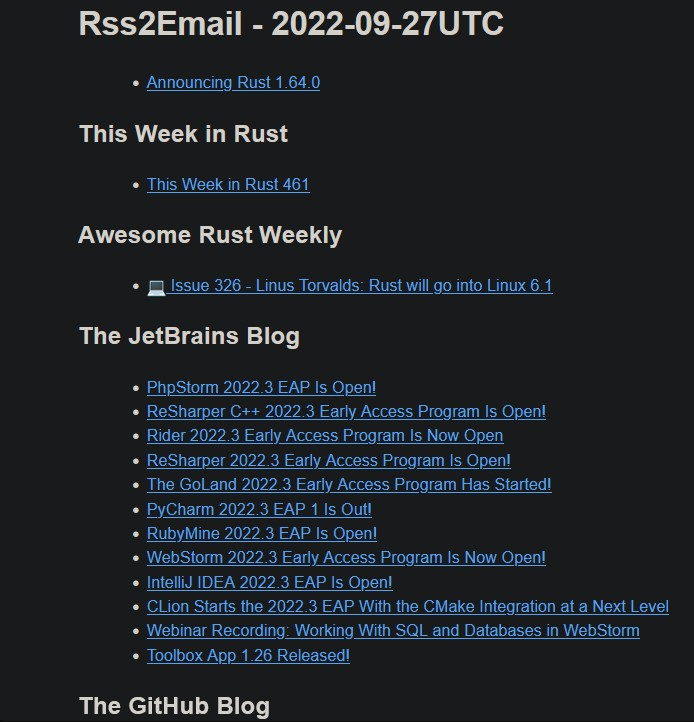

# Rss2Email

[](https://github.com/AntoniosBarotsis/Rss2Email/actions/workflows/ci.yml)
[](https://github.com/users/AntoniosBarotsis/projects/2/views/1?query=is%3Aopen+sort%3Aupdated-desc)


A small program capable of aggregating content from multiple RSS/Atom feeds and mailing them to you in a practical summary email.  
Keep track of your favorite blogs that don't feature an update newsletter
or similar service.

<p align="center">
  
</p>

## Dependencies

You'll need [Rust](https://rust-lang.org/) installed to compile this software.

## Installation

Currently, you can only build this from source.
Clone this repository and run:

```bash
cargo build --release
```

Alternatively, you can build a Docker image that you can either run yourself or publish to AWS Lambda.

Check out the [build from [source](https://github.com/AntoniosBarotsis/Rss2Email/wiki/1.-Home#building-from-source)
section of the wiki for more information.

## Configuration

**Rss2email** requires some environment variables to work. These can be provided either in your shell
or as entries in a `.env` file.

- `EMAIL_ADDRESS`: the mail address you will receive the feed content
- `DAYS`: this value indicates up to how many days in the past we go to search for entries  

- `FEEDS`: a list of semicolon-separated feed URLs.  
  _eg:_ `"https://blog.rust-lang.org/feed.xml;https://www.linux.org/articles/index.rss"`

- `EMAIL` (optional, defaults to `SendGrid`):  Which provider to use to send the email.  
  Can be set to `EMAIL_COMMAND` as an alternative if you have `mail` or `sendmail` installed in your system  

- `API_KEY` (optional): Your [SendGrid](https://sendgrid.com/) authentication key.

More details are available in the [Running the code](https://github.com/AntoniosBarotsis/Rss2Email/wiki/3.-Running-the-Code)
wiki section.

## Usage

Running the code in debug mode won't send any emails and will instead output the generated HTML in the console.

```bash
cargo run
```

It is recommended to try this out first and make sure that all your feeds and config variables are correctly set
up.

Running the project in release mode will send the emails

```bash
./target/release/Rss2email
# or
cargo run --release
```

<!-- ## Known Issues -->

## Contributing

Thanks for considering contributing!

Read [this](./CONTRIBUTING.md).
