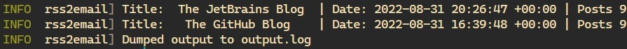

# Rss2Email

This project collects blog posts made over the last `n` days from RSS feeds and emails them to you!

This is still in its infancy so expect things to change!

## Why?

I have a few blogs in mind that I do find interesting but they do not provide a newsletter.

There are some RSS readers but I am too lazy to download and use other software exclusively for this,
I would much rather see a summary of these posts in my mailbox.

## Getting Started

All you need to do is create a `feeds.txt` file in the root of the project and run `cargo run`.

For now, this will dump all blog posts from the feeds you provide in the `output.log` file. Sending
emails is not implemented yet.

The `feeds.txt` file could look something like this;

```txt
https://antoniosbarotsis.github.io/index.xml
https://blog.rust-lang.org/feed.xml
https://blog.rust-lang.org/inside-rust/feed.xml
https://github.blog/feed
```

If you see none of these websites mentioned in the logs then (hopefully) none of them made a new post in the
last 7 days, otherwise, something might be wrong in the code.

The logs should look something like this:

<div align="center">
  
</div>

The output should contain the name of the website and the post's title, publication date as well as the link.

Currently, this is hard-coded to display results from feeds that were updated within the last 7 days, this
will be configurable in the future.

## Tips for Finding RSS Feeds

Not all blogs tell you where their RSS feed is stored but I found that almost all of them have one.
In the blogs that I tried this with, the XML file was usually in one of the following locations:

- `./index.xml`
- `./rss`
- `./feed`
- `./feed.xml`

If these don't work, try using *Inspect Element* in your browser and look for `rss`

Example: 

```html
<link 
  rel="alternate" 
  type="application/rss+xml" 
  title="The GitHub Blog » Feed" 
  href="https://github.blog/feed/"
>
```

## Why is this so Slow?

Currently, the RSS feeds are downloaded in a sequential, blocking manner as they are only small text files
and should thus not take too long (plus this is not supposed to run that often but rather something
like once a week or so). 

If you find yourself either using a *lot* of RSS feeds or really big ones somehow, do give me a heads up
by submitting an issue and I'll do what I can to make this faster. As of now, there is no reason to do that.

## Project Status

As I am mostly satisfied with the *getting the RSS feeds* part of the project, I now need to look for a way
to send the emails and am considering some different options for this. Shouldn't take too long but don't
expect any progress in the repository for the time being.

## Contributing

Thanks for considering contributing!

Read [this](./CONTRIBUTING.md).
